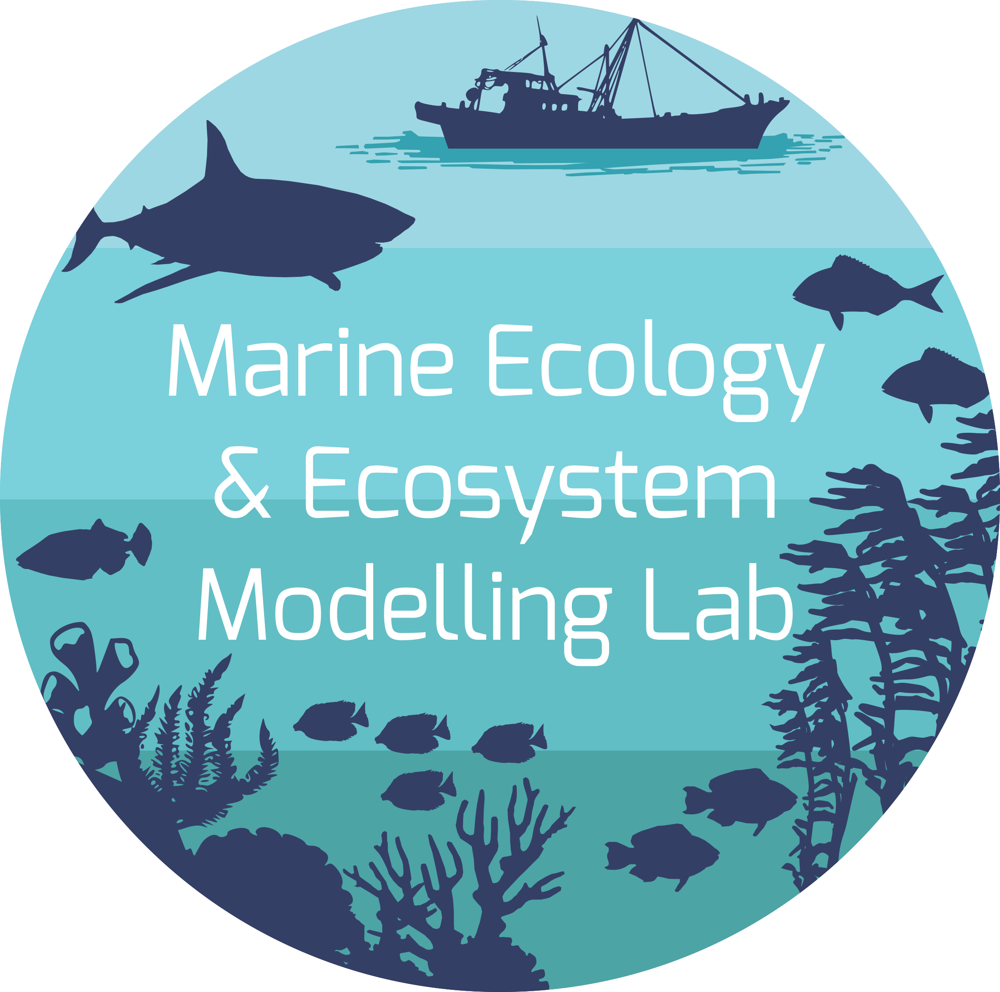
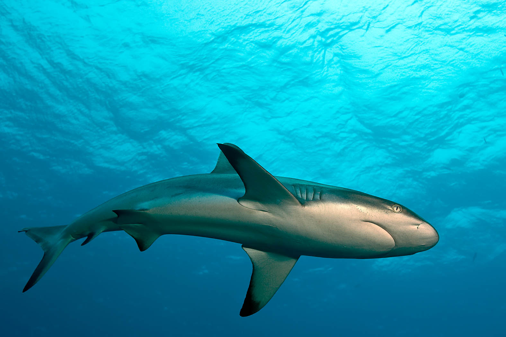
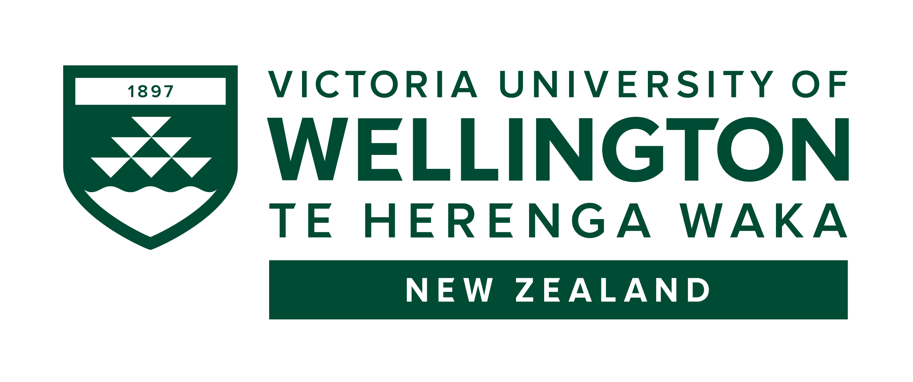
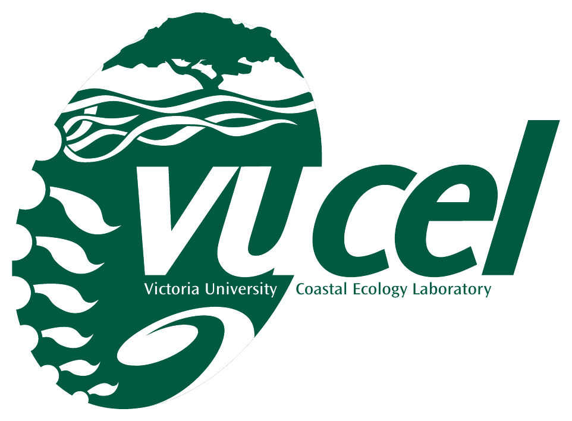

## Who We Are

The Marine Ecology and Ecosystem Modelling (MEEM) Lab is part of the [School of Biological Sciences](https://www.wgtn.ac.nz/sbs) at [Victoria University of Wellington](https://www.wgtn.ac.nz/sbs/research/marine-biology-research) in Wellington, New Zealand. We are a team of mathematically minded ecologists dedicated to understanding and quantifying the impacts of environmental and human-induced change on marine ecosystems. We are based at [Coastal Ecology Lab (VUCEL)](https://www.wgtn.ac.nz/sbs/research-centres-institutes/vucel) on the south coast of Wellington.

## What We Do

Our research spans deep sea, shallow-water, and coastal communities, with a particular focus on how climate change and human activities affect fish populations and fisheries. Combining field data collection with advanced ecosystem modelling, we investigate how habitat change and degradation influence both tropical and temperate fish communities—from coral reefs to kelp forests. Our goal is to promote long-term sustainability by providing robust scientific tools and insights for ecosystem and fisheries managers, supporting the conservation and responsible management of marine resources.

We collaborate with many organisations, including [Wellington City Council](https://wellington.govt.nz/), the [Department of Conservation (DOC)](https://www.doc.govt.nz/), [Earth Sciences New Zealand](https://niwa.co.nz/) (formerly NIWA), and the [Save Our Seas Foundation](https://saveourseas.com/).

Explore our research, meet our people, and get involved!

Lab shark photo

::: {.page-footer-note}
Last updated: `r format(Sys.Date(), '%Y-%m-%d')`
:::